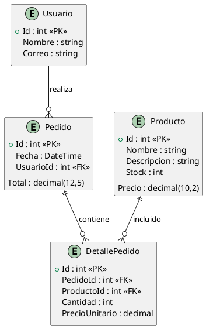

# Análisis de Entidades y Diagramas UML

## 1. Resumen de entidades detectadas

**Entidades:**
- Usuario
  - Id (int, PK)
  - Nombre (string, 200)
  - Correo (string, 200)
- Pedido
  - Id (int, PK)
  - Fecha (DateTime)
  - Total (decimal, 12,5)
  - UsuarioId (int, FK → Usuario)
- DetallePedido
  - Id (int, PK)
  - PedidoId (int, FK → Pedido)
  - ProductoId (int, FK → Producto)
  - Cantidad (int)
  - PrecioUnitario (decimal)
- Producto
  - Id (int, PK)
  - Nombre (string, 200)
  - Descripcion (string, 200)
  - Precio (decimal, 10,2)
  - Stock (int)

**Relaciones identificadas:**
- Un Usuario puede tener muchos Pedidos
- Un Pedido pertenece a un Usuario
- Un Pedido puede tener muchos DetallePedido
- Un DetallePedido pertenece a un Pedido y a un Producto
- Un Producto puede estar en muchos DetallePedido

---

## 2. Diagrama ER en formato UML (PlantUML)



---

## 3. Diagrama de arquitectura en capas UML (PlantUML)

```plantuml
@startuml
package "Concurso.App.gestion" {
  [Web] --> [Application]
  [Application] --> [Domain]
  [Application] --> [Infrastructure]
  [Infrastructure] --> [Domain]
}

[Web] : Controllers\nViews\nAPI\nSwagger
[Application] : DTOs\nServicios\nAutoMapper
[Domain] : Entidades\nReglas de Negocio
[Infrastructure] : EF Core\nDbContext\nMigraciones
@enduml
```
